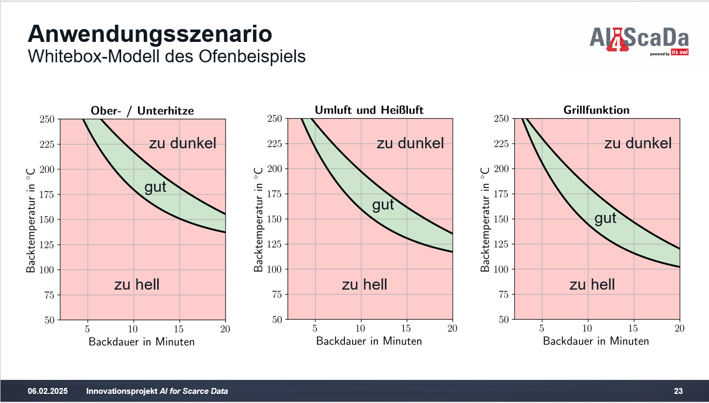

# Oven Model App

## Beschreibung

Die **Oven Model App** ist eine Anwendung, die entwickelt wurde, um das erwartete Backergebnis von Brötchen zu erhalten und ein entsprechendes Label auszugeben. Der Benutzer kann die Temperatur, die Zeit und die Ofeneinstellung auswählen und erhält das modellspezifische Brötchenbackergebnis.

Dieses Modell soll als Unterstützung für das Anwendungsbeispiel dienen, um Label auf Basis eines mathematisch definierten Modells generieren zu können und somit "reale" Label auf Basis eines Modells im Anwendungsbeispiel verwenden zu können.

## Funktionen

- Eingabe der Temperatur zwischen 50°C und 250°C.
- Eingabe der Backzeit zwischen 2 und 20 Minuten.
- Auswahl der Ofeneinstellung: Heißluft, Grill oder Ober- und Unterhitze.
- Anzeige des Ergebnisses in Form eines Modelllabels ("zu hell", "passend", "zu dunkel") basierend auf den angegebenen Parametern.

## Exponentialfunktionen zur Bestimmung des Backergebnisses (Model)

In diesem Beispiel wird der Parameterraum mit Hilfe von zwei Exponentialfunktionen in die Bereiche "zu hell", "zu dunkel" und "passend" eingeteilt. Dabei handelt es sich nicht um reale Ergebnisse, sondern um eine frei definierte Unterteilung.

1. **Funktion f_x**:

   - Diese Funktion modelliert die obere Grenze der optimalen Backtemperatur in Abhängigkeit von der Zeit. Sie wird definiert als:
     $$
     f_x = \beta \cdot e^{-\alpha \cdot \text{time}} + c
     $$
   - Hierbei sind:
     - $\beta = 245.0$ (ein Konstante, die die maximalen Temperaturwerte beeinflusst)
     - $\alpha = 0.150$ (bestimmt die Rate des Temperaturabfalls mit der Zeit)
     - $c = 105 + \text{offset}$ (ein Wert, der abhängig vom Ofenmodus variiert und die Basislinie festlegt)

2. **Funktion h_x**:
   - Diese Funktion modelliert die untere Grenze der optimalen Backtemperatur. Sie wird definiert als:
     $$
     h_x = \beta_2 \cdot e^{-\alpha_2 \cdot \text{time}} + c_2
     $$
   - Hierbei sind:
     - $\beta_2 = 250.0$ (maximaler Temperaturwert für diese Funktion)
     - $\alpha_2 = 0.060$ (bestimmt die Rate des Temperaturabfalls)
     - $c_2 = 60 + \text{offset}$ (Basislinie, ebenfalls abhängig vom Ofenmodus)

Diese beiden Funktionen helfen dabei, die Temperaturgrenzen zu bestimmen, die für ein optimales Backergebnis erforderlich sind, und ermöglichen es der Anwendung, das Ergebnis als "zu hell", "zu dunkel" oder "passend" zu klassifizieren.

Hier ist eine Visualisierung der Modelllabels:

Die obige Grafik zeigt die definierte mathematische Beziehung zwischen der Backzeit und der Temperatur, die für das Backen von Brötchen erforderlich ist. Die verschiedenen Bereiche verdeutlichen, ob das Ergebnis zu hell, zu dunkel oder optimal ist.
